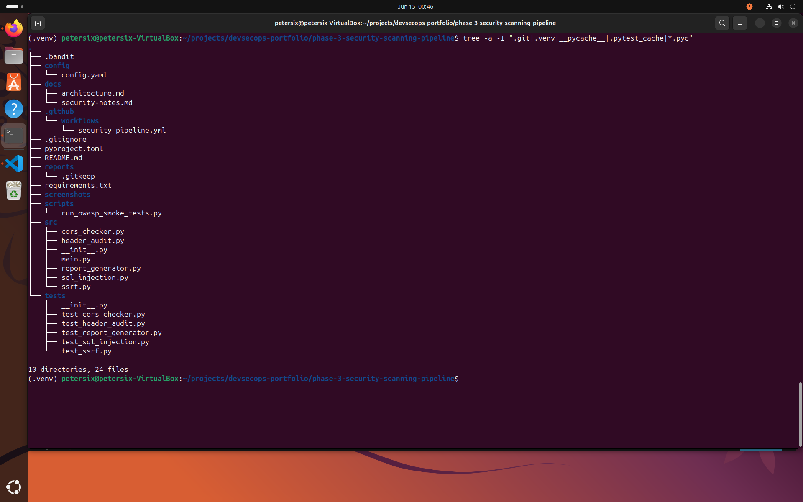
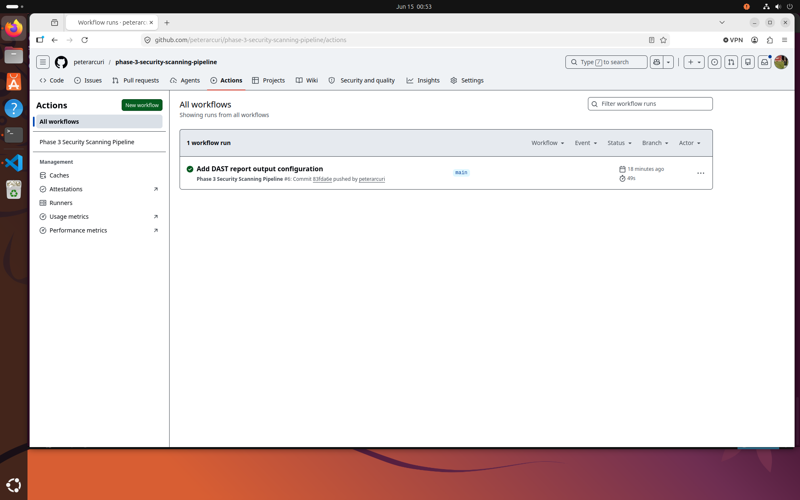
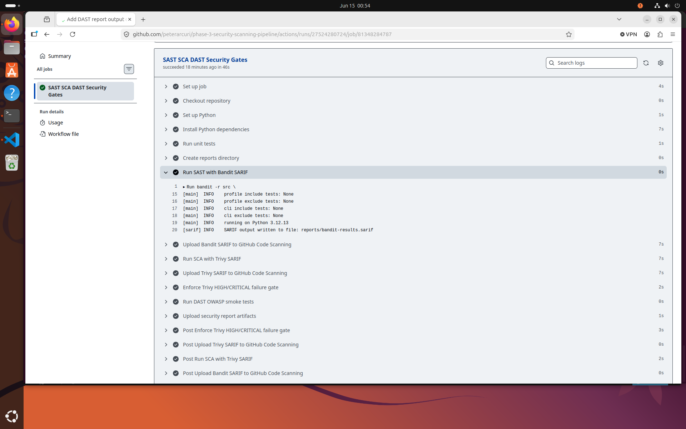
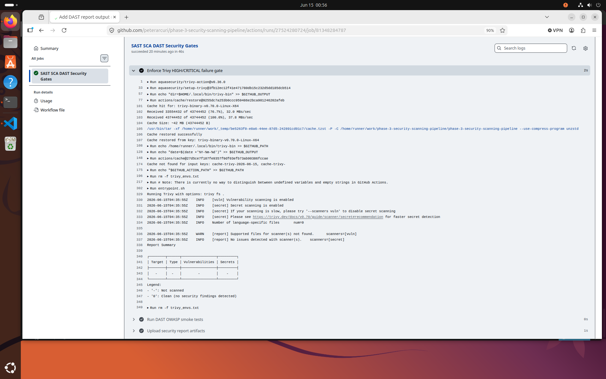
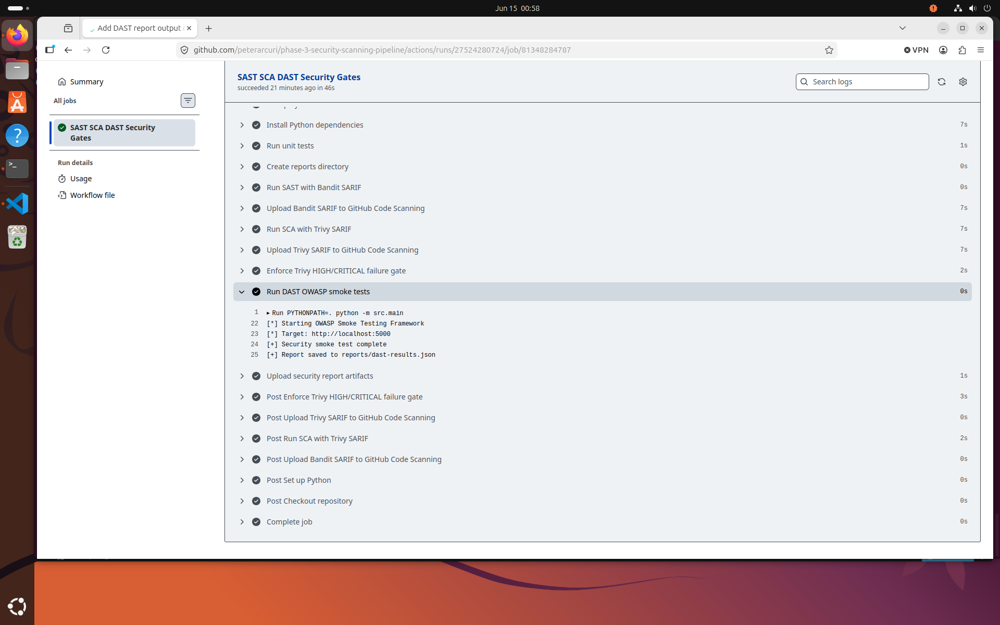
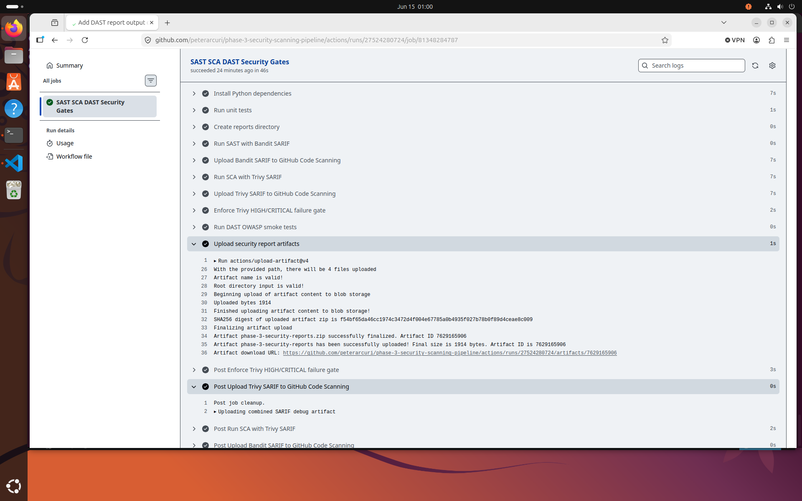

# Phase 3 — Security Scanning Pipeline

A production-inspired **DevSecOps security pipeline** built with **GitHub Actions** that automatically performs:

* **Static Application Security Testing (SAST)** using Bandit
* **Software Composition Analysis (SCA)** using Trivy
* **Dynamic Application Security Testing (DAST)** using a custom OWASP Smoke Testing Framework
* **SARIF security reporting**
* **Security artifact uploads**
* **Automated build failure gates** for HIGH and CRITICAL vulnerabilities

This project demonstrates a shift-left security approach by integrating automated security validation directly into the CI/CD pipeline.

---

# Objectives

The primary goals of this project are to:

* Automate security testing during continuous integration
* Detect insecure coding patterns using SAST
* Identify vulnerable dependencies using SCA
* Execute runtime security checks using DAST
* Generate machine-readable security reports
* Enforce security quality gates before deployment
* Showcase practical DevSecOps engineering skills for a GitHub portfolio

---

# Security Stack

| Category  | Tool                                 |
| --------- | ------------------------------------ |
| CI/CD     | GitHub Actions                       |
| SAST      | Bandit                               |
| SCA       | Trivy                                |
| DAST      | Custom OWASP Smoke Testing Framework |
| Reporting | SARIF                                |
| Artifacts | GitHub Actions Artifacts             |

---

# Features

## Current Features

* Automated GitHub Actions workflow
* Static Application Security Testing (Bandit)
* Software Composition Analysis (Trivy)
* Dynamic Application Security Testing (OWASP Smoke Tester)
* SARIF report generation
* Security artifact uploads
* Automated HIGH/CRITICAL vulnerability gates
* Python-based security testing
* Configurable YAML-driven scanning

## Planned Enhancements

* Secret scanning integration
* SBOM generation
* Infrastructure-as-Code security scanning
* Container image security validation
* License compliance checks
* Expanded OWASP Top 10 coverage
* Automated remediation reporting

---

# Project Structure

```text
phase-3-security-scanning-pipeline/
├── .github/
│   └── workflows/
│       └── security-pipeline.yml
├── config/
├── docs/
├── reports/
├── screenshots/
├── scripts/
├── src/
├── tests/
├── .bandit
├── .gitignore
├── pyproject.toml
├── README.md
└── requirements.txt
```

---

# Security Pipeline Workflow

The GitHub Actions pipeline executes the following stages:

1. Check out repository
2. Install project dependencies
3. Execute automated unit tests
4. Run Bandit SAST analysis
5. Upload Bandit SARIF results
6. Execute Trivy SCA scans
7. Upload Trivy SARIF results
8. Enforce HIGH/CRITICAL vulnerability gates
9. Execute the OWASP Smoke Testing Framework (DAST)
10. Upload security reports and workflow artifacts

---

# Skills Demonstrated

* DevSecOps Engineering
* Secure CI/CD Pipelines
* GitHub Actions Automation
* Static Application Security Testing (SAST)
* Software Composition Analysis (SCA)
* Dynamic Application Security Testing (DAST)
* Security Report Generation
* SARIF Integration
* Automated Security Gates
* Shift-Left Security Practices
* Python Security Tooling

---

# Screenshots

## Project Structure

Shows the repository layout, including workflow configuration, source code, tests, documentation, reports, and supporting files.



---

## Successful GitHub Actions Workflow

Displays the successful execution of the complete security pipeline within GitHub Actions.



---

## Bandit SAST Execution

Demonstrates automated Static Application Security Testing (SAST) using Bandit to analyze Python source code for common security issues.



---

## Trivy Software Composition Analysis (SCA)

Shows Trivy scanning project dependencies and the filesystem for HIGH and CRITICAL vulnerabilities as part of the automated security pipeline.



---

## OWASP Smoke Tester (DAST)

Demonstrates execution of the custom Dynamic Application Security Testing (DAST) framework to perform runtime security validation against the target application.



---

## Security Artifacts and SARIF Upload

Shows successful generation and upload of security reports and SARIF artifacts for post-build analysis and integration with GitHub security features.



---

# Documentation

Additional project documentation is available in the `docs/` directory:

* `architecture.md` – security pipeline architecture and workflow
* `security-notes.md` – implementation details and security considerations

---

# Running Locally

Create and activate a virtual environment:

```bash
python3 -m venv .venv
source .venv/bin/activate
```

Install dependencies:

```bash
pip install -r requirements.txt
```

Run unit tests:

```bash
PYTHONPATH=. pytest -v
```

Run Bandit:

```bash
bandit -r src --severity-level high --confidence-level medium
```

Run the OWASP Smoke Testing Framework:

```bash
PYTHONPATH=. python -m src.main
```

---

# Disclaimer

This project is intended for educational purposes and authorized security testing only.

Dynamic security testing should only be performed against systems that you own or have explicit permission to assess.
